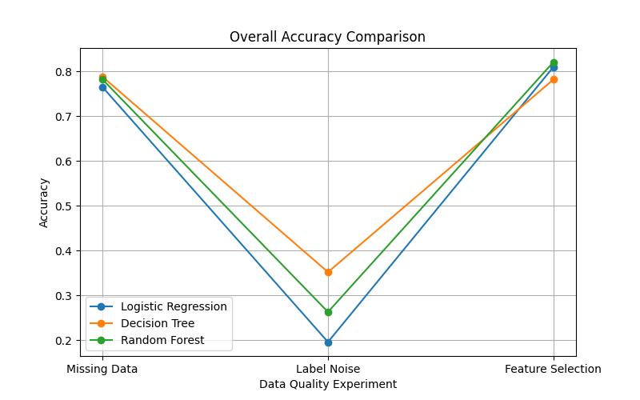
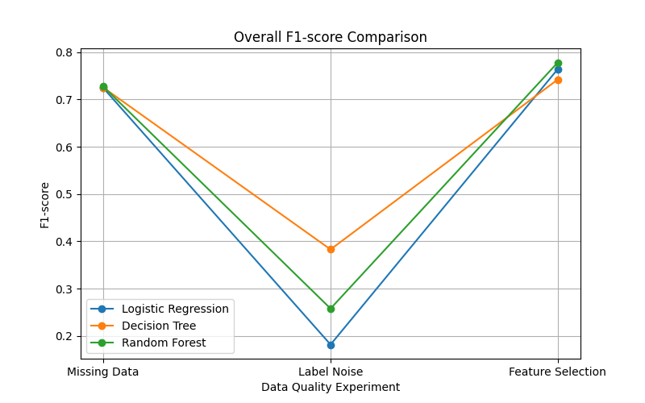

<div align="center">

# The Influence of Data Quality on Machine Learning Model Accuracy

### A reproducible machine learning research project using the Titanic dataset

<p>
  
  
  
</p>

<p>
  This study investigates whether data quality has a greater influence on machine learning performance<br>
  than the choice of classification algorithm.
</p>

</div>

---

## Contents

- [Research Overview](#research-overview)
- [Research Question and Hypothesis](#research-question-and-hypothesis)
- [Objectives](#objectives)
- [Study at a Glance](#study-at-a-glance)
- [Dataset](#dataset)
- [Models](#models)
- [Experimental Design](#experimental-design)
- [Evaluation Metrics](#evaluation-metrics)
- [Current Results](#current-results)
- [Visual Results](#visual-results)
- [Methodology](#methodology)
- [Repository Structure](#repository-structure)
- [Reproducibility](#reproducibility)
- [Research Status](#research-status)
- [Future Work](#future-work)
- [Author](#author)

## Research Overview

Machine learning performance depends not only on the algorithm selected, but also on the quality of the data used to train and evaluate it. This project examines that relationship through controlled experiments on the Titanic survival-classification dataset.

The study investigates three data-quality factors:

1. Missing data
2. Feature selection
3. Label noise

Each factor is evaluated across three machine learning models:

- Logistic Regression
- Decision Tree
- Random Forest

The project is maintained as a research record and as part of an academic portfolio. The README reports only results currently available in the repository; it does not claim that the research hypothesis has been confirmed before the final comparison is complete.

## Research Question and Hypothesis

### Research question

> To what extent does data quality affect the accuracy of machine learning models compared to the choice of algorithm?

### Hypothesis

> Data quality has a greater influence on the performance of machine learning models than the choice of algorithm.

The hypothesis remains under evaluation. A final conclusion requires a systematic comparison of performance changes across all data-quality conditions and algorithms.

## Objectives

- Measure the effect of missing data on model performance.
- Examine the effect of using basic, extended, and all available features.
- Investigate the effect of controlled label noise.
- Compare Logistic Regression, Decision Tree, and Random Forest under comparable conditions.
- Evaluate data-quality effects alongside algorithm-selection effects.
- Preserve a reproducible workflow for future extensions and review.

## Study at a Glance

| Aspect | Description |
| --- | --- |
| Research area | Data quality and machine learning performance |
| Dataset | Titanic survival dataset |
| Task | Binary classification |
| Models | Logistic Regression, Decision Tree, Random Forest |
| Data-quality factors | Missing data, feature selection, label noise |
| Missing-data levels | 0%, 10%, 20%, 30% |
| Label-noise levels | 0%, 10%, 20%, 30% |
| Feature configurations | Basic, extended, all features |
| Primary comparison | Data-quality influence versus model-choice influence |
| Current status | Experiments in progress; final interpretation pending |

## Dataset

The experiments use the Titanic dataset, a binary-classification dataset in which the target variable represents passenger survival.

The preprocessing workflow supports controlled variations in:

- Missing-value conditions
- Feature subsets
- Label-noise levels
- Training and evaluation procedures

The dataset is used as a consistent benchmark for comparing changes in model performance under different data-quality conditions.

## Models

| Model | Function in the study |
| --- | --- |
| Logistic Regression | Linear baseline classifier |
| Decision Tree | Interpretable non-linear classifier |
| Random Forest | Ensemble classifier composed of multiple decision trees |

Using models with different structures makes it possible to examine whether data-quality changes affect simple, interpretable, and ensemble approaches differently.

## Experimental Design

| Experiment | Conditions | Main question |
| --- | --- | --- |
| Missing data | 0%, 10%, 20%, 30% missing values | How does increasing incompleteness affect performance? |
| Feature selection | Basic, extended, and all features | How much does the selected information content affect performance? |
| Label noise | 0%, 10%, 20%, 30% noisy labels | How sensitive are the models to incorrect target labels? |
| Model comparison | Three algorithms under comparable conditions | How large is the effect of algorithm choice relative to data quality? |

### Missing Data

Model performance is evaluated after introducing increasing proportions of missing values:

- 0% missing data
- 10% missing data
- 20% missing data
- 30% missing data

### Feature Selection

The experiments compare progressively broader feature configurations:

- Basic features
- Extended features
- All available features

### Label Noise

The target labels are evaluated under controlled noise levels:

- 0% noise
- 10% noise
- 20% noise
- 30% noise

## Evaluation Metrics

The study uses multiple complementary metrics:

| Metric | Purpose |
| --- | --- |
| Accuracy | Overall proportion of correct predictions |
| Precision | Reliability of positive predictions |
| Recall | Coverage of actual positive cases |
| F1-score | Balance between precision and recall |
| Confusion matrix | Detailed view of correct and incorrect class predictions |

Accuracy is therefore interpreted together with precision, recall, F1-score, and confusion matrices rather than being treated as the only measure of model quality.

## Current Results

The current repository reports the following model-comparison values:

| Model | Accuracy | Precision | Recall | F1-score |
| --- | ---: | ---: | ---: | ---: |
| Logistic Regression | 0.816 | Not reported in current snapshot | Not reported in current snapshot | Not reported in current snapshot |
| Decision Tree | 0.821 | Not reported in current snapshot | Not reported in current snapshot | Not reported in current snapshot |
| Random Forest | 0.827 | 0.877 | 0.676 | 0.763 |

### What is currently represented

- Missing-data experiments
- Label-noise experiments
- Feature-selection experiments
- Model-comparison experiments
- Generated result tables
- Generated visualizations

The table above is a snapshot of the values currently reported by the project. Missing metrics are explicitly identified rather than estimated or inferred. The complete interpretation of the hypothesis depends on the final cross-condition analysis.

## Visual Results

The repository contains visualizations for the main experiment families. The gallery below links directly to the generated figures in [`images/`](./images).

### Model comparison

| Accuracy comparison | F1-score comparison |
| --- | --- |
| [](./images/model_accuracy_comparison.png) | [](./images/model_f1_comparison.png) |

### Data-quality comparisons

| Overall accuracy | Overall F1-score |
| --- | --- |
| [](./images/comparison_accuracy.png) | [](./images/comparison_f1.png) |

### Missing-data analysis

| Logistic Regression | Decision Tree |
| --- | --- |
| [](./images/accuracy_missing_data_regression.png) | [](./images/accuracy_decision_tree_missing.png) |

| Random Forest accuracy | Random Forest F1-score |
| --- | --- |
| [](./images/random_forest_missing_accuracy.png) | [](./images/f1_random_forest_missing.png) |

| Decision Tree F1-score | Missing-data F1-score |
| --- | --- |
| [](./images/f1_decision_tree_missing.png) | [](./images/f1_missing_data.png) |

### Feature selection and label noise

| Feature-selection accuracy | Feature-selection F1-score |
| --- | --- |
| [](./images/accuracy_feature_selection.png) | [](./images/f1_feature_selection.png) |

| Label-noise accuracy | Label-noise F1-score |
| --- | --- |
| [](./images/accuracy_noisy_data_regression.png) | [](./images/f1_noise_impact.png) |

## Methodology

The experimental workflow follows these stages:

1. Load the Titanic dataset.
2. Inspect and preprocess the data.
3. Define the feature sets and target variable.
4. Train Logistic Regression, Decision Tree, and Random Forest models.
5. Create controlled missing-data, feature-selection, and label-noise conditions.
6. Evaluate each model using the selected metrics.
7. Save tabular results to [`results/`](./results).
8. Generate figures for [`images/`](./images).
9. Compare the effect of data-quality changes with differences between algorithms.

For a fair comparison, preprocessing, train-test splitting, and evaluation procedures should remain consistent across comparable experiments.

## Repository Structure

The following structure reflects the current repository organization:

```text
data-quality-vs-model-performance/
├── datasets/       # Dataset files
├── images/         # Generated graphs and visualizations
├── notebooks/      # Google Colab and Jupyter experiment notebooks
├── results/        # CSV files containing experimental outputs
├── report/         # Research paper and supporting documents
├── src/            # Reusable Python modules as the project develops
├── requirements.txt
└── README.md
```

The `notebooks/` directory contains the model and data-quality experiments. The `results/` and `images/` directories contain the currently available outputs. Additional reusable modules and research documentation may be added as the project develops.

## Reproducibility

### Clone the repository

```bash
git clone https://github.com/mksmedvedmain-boop/data-quality-vs-model-performance.git
cd data-quality-vs-model-performance
```

### Create a virtual environment

```bash
python -m venv .venv
```

Activate it on macOS or Linux:

```bash
source .venv/bin/activate
```

Activate it on Windows PowerShell:

```powershell
.venv\Scripts\Activate.ps1
```

### Install dependencies

```bash
pip install -r requirements.txt
```

### Run the notebooks

Open the relevant notebook from [`notebooks/`](./notebooks) in Google Colab or a local Jupyter environment. Confirm the dataset path, then run the cells in order.

To start Jupyter locally:

```bash
jupyter notebook
```

Generated result tables should be stored in [`results/`](./results), and generated figures should be stored in [`images/`](./images).

## Research Status

### Completed or currently represented

- Data preprocessing
- Missing-data experiments
- Label-noise experiments
- Feature-selection experiments
- Model comparison
- Result tables and visualizations

### Planned or in progress

- Hyperparameter tuning
- Cross-validation
- Final research report
- Consolidated interpretation of the hypothesis

## Future Work

Possible extensions include:

- Hyperparameter optimization
- Cross-validation and repeated evaluation
- ROC curve analysis
- Precision-recall curve analysis
- Feature-importance analysis
- Evaluation of additional algorithms, including XGBoost and LightGBM
- More formal statistical comparison of data-quality effects and model-choice effects

## Technologies

- Python 3.x
- pandas
- NumPy
- Matplotlib
- scikit-learn
- Google Colab
- Jupyter Notebook
- GitHub

## Author

**Ivan Medvedev**

Student researcher interested in machine learning, artificial intelligence, and data science.

## License

This repository is intended for academic and educational research. A formal open-source license can be added if the project is distributed for reuse beyond the current research context.

---

This project studies the relationship between data quality and machine learning performance through controlled experiments. Its current status is ongoing, and the final conclusions will be updated as the remaining analyses are completed.
